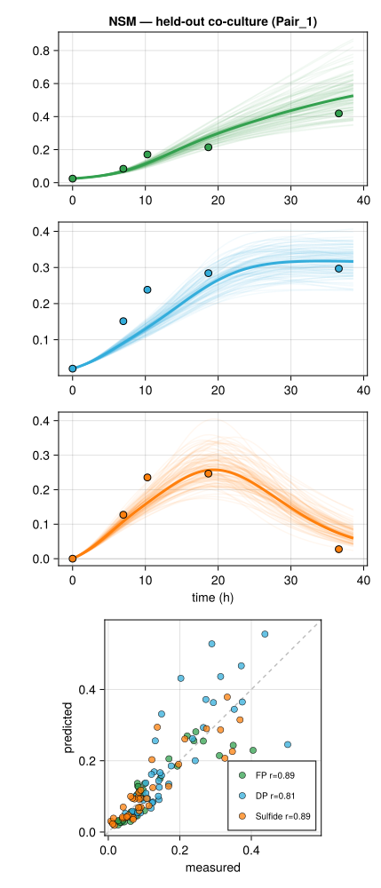
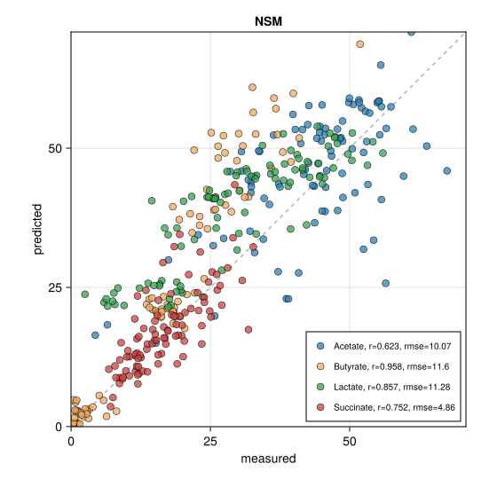

# NSMjl — Neural Species Mediator in Julia

A from-scratch Julia implementation of the NSM model (Thompson et al. 2025,
Venturelli lab): a mechanistic consumer-resource law embedded in a neural ODE,
fit by variational Bayesian inference with EM hyperparameter optimization.

---

## Results — held-out predictions

### 1. FP-DP — leave-one-co-culture-out

`scripts/run_nsm.jl` → `figures/fig_nsm_fpdp_loo.svg`



Hold out one co-culture (`Pair_*`) per fold (10 folds); monocultures always in
training and never scored; fit each fold with `fit_posterior_EM!`; pool the 10
held-out co-cultures and report per-output Pearson r.

| Output  | r    |
|---------|:----:|
| FP      | 0.89 |
| DP      | 0.81 |
| Sulfide | 0.89 |

Negative (unphysical) predictions: 0.0%.

### 2. Clark 25-species — 16h interpolation

`scripts/run_clark.jl` → `figures/fig_clark_16h.svg`



Train on all timepoints except 16h; predict the (0 → 16h) transition; fit with
`fit_posterior_EM!`, `n_hidden=20`. 757 treatments, 852 train / 95 test samples.
Reverse-mode adjoint (`AD = :reverse`) is required at this scale (~1,400 params).
NRMSE = RMSE ÷ each metabolite's training-row max.

| Metabolite | r     | NRMSE |
|------------|:-----:|:-----:|
| Acetate    | 0.623 | 0.141 |
| Butyrate   | 0.958 | 0.199 |
| Lactate    | 0.857 | 0.128 |
| Succinate  | 0.752 | 0.086 |

---

## Reproduction scripts

- `scripts/run_nsm.jl` — FP-DP. Leave-one-co-culture-out over the 10 `Pair_*`
  conditions, `fit_posterior_EM!` per fold, per-fold training-target scaling,
  `n_hidden=15`, 4-panel figure (3 posterior-predictive trajectory panels +
  pooled scatter). Includes a **BC026 data-integrity check** that halts before
  the fit if `data/BC026_FPDP_GlLaSu_fmt.csv` isn't the expected file
  (150 rows, times `0/6.97/10.28/18.66/36.58`).
- `scripts/run_clark.jl` — Clark. 16h interpolation, `fit_posterior_EM!`,
  `n_hidden=20`, per-metabolite r/RMSE scatter. `AD = :reverse` flag for the
  25-species scale.

Both score with per-output Pearson r on the held-out data.

---

## Method

The objective is the KL-minimizing variational posterior; ELBO maximization ≡
KL minimization by `log p(D) = ELBO + KL[q‖p]` (the log-evidence is constant in
the variational parameters).

- **Model** — mechanistic consumer-resource metabolite law embedded in a neural
  ODE (below); `C, P, d_m` kept positive via a base-10 softplus transform `g`.
- **Prior** — zero-mean Gaussian on every parameter, `Σ ½ α (θ)²`.
- **Likelihood** — heteroscedastic Gaussian, variance `ν² + σ²·clip(ŷ, 0)²`.
- **Posterior** — mean-field diagonal Gaussian `q = N(μ, diag(exp(2·log_s)))`,
  reparameterised `z = μ + exp(log_s)·y`, entropy `Σ log_s`.
- **`fit_posterior!`** — per-sample stochastic Adam on `[μ; log_s]` (fresh draw
  per sample), run to ELBO-slope convergence (`tol=1e-3`, `patience=5`), keeps
  the best-ELBO iterate.
- **`update_hypers!`** — empirical-Bayes EM step: per-output least-squares noise
  fit (`ν², σ²`) and zero-mean prior precision `α = 1/E[θ²] = 1/(μ²+σ²)`.
- **`fit_posterior_EM!`** — alternates posterior and hyperparameter updates,
  judged by the recomputed evidence, retaining the highest-evidence iterate.

**Autodiff.** `fit_posterior!`/`fit_rmse!` take an `ad` switch: `:forward`
(ForwardDiff-through-solve — fast for small models like FP-DP) or `:reverse`
(Zygote + SciMLSensitivity `InterpolatingAdjoint(ReverseDiffVJP(true))` — cost
~independent of parameter count; required for Clark's 25 species). Reverse-mode
*hurts* tiny models (per-solve adjoint overhead) but is a ~100× win at 1,000+
parameters.

---

## The model (what `nsm_rhs!` computes)

State `u = [s; m]` (species stacked on mediators). With `[o_s; o_m] = NN([s; m])`:

```
dsdt = s .* o_s .* (1 - s/s_cap)                                  # eNODE (keeps s ≥ 0)
dmdt = softplus(o_m) .* ( (P·relu(dsdt)).*(1 - m/m_cap)           # consumer-resource
                          - m .* (C·s + d_m) )                    #  (NN multiplies it)
```

`C, P, d_m` are stored unconstrained and passed through `g(·)` inside the RHS to
stay positive.

---

## Package layout

| File | Contents |
|---|---|
| `src/system.jl`  | activations, positivity transform `g`/`g_inv`, `NSMConfig`, `init_params`, `nsm_rhs!` |
| `src/NSMjl.jl`   | module + `solve_forward` |
| `src/train.jl`   | `Sample`, `predict_endpoint` (forwards `sensealg`), `sample_rmse`, `rmse`, `fit_rmse!` |
| `src/bayes.jl`   | `prior_params` (zero-mean), `log_prior`, `nll_sample`, `nlp`, `grad_nlp`, `fit_map!` |
| `src/vi.jl`      | `VarPosterior` (+ `VarPosterior(p, cfg)` per-parameter init), `neg_elbo_flat`, `approx_evidence`, `fit_posterior!`, `update_hypers!`, `fit_posterior_EM!` |
| `src/predict.jl` | `predict_point`, `predict_sample`, `credible_bands` |
| `src/dataio.jl`  | `load_nsm_csv` (Venturelli-format CSV reader) |

Each training `Sample` is an (initial condition → one later observation) pair
integrated `0 → tf`.

---

## Status

- **Step 1 — dynamical system ✅**
- **Step 2 — training (loss + Adam fit) ✅**
- **Step 3a — Bayesian objective (nlp + MAP) ✅**
- **Step 3b — variational posterior + EM + evidence ✅**
- **Step 4 — prediction with uncertainty ✅**
- **FP-DP reproduction ✅ ; Clark reproduction ✅**

Component validation lives in `test/` (`smoke_forward.jl`, `train_fit.jl`,
`bayes_fit.jl`, `vi_fit.jl`, `predict_fit.jl`) — each checks a stage's numerics
and that its fitter improves the objective.

---

## Future work

- **Time-dependent perturbation inputs `u(t)`.** Extend the RHS to evaluate an
  input schedule `u(t)` at every solver step, so training can be driven by a
  time-varying perturbation (e.g. an antibiotic time-course) rather than static
  per-condition inputs.
- **MiCRM-based PINN.** Swap the phenomenological consumer-resource metabolite
  law for the Microbial Consumer-Resource Model — leakage fraction, a
  cross-feeding stoichiometry matrix `D`, and latent (unmeasured) resources — as
  the mechanistic prior: the NN sets species growth while MiCRM governs resource
  dynamics with explicit mass conservation and species-to-species metabolic
  hand-offs.

---

## Run it

```bash
julia --project=. -e 'using Pkg; Pkg.instantiate()'   # first time (CairoMakie is large)

# component validation
julia --project=. test/smoke_forward.jl               # step 1
julia --project=. test/train_fit.jl                   # step 2
julia --project=. test/bayes_fit.jl                   # step 3a
julia --project=. test/vi_fit.jl                      # step 3b
julia --project=. test/predict_fit.jl                 # step 4

# held-out reproductions
julia --project=. scripts/run_nsm.jl                  # FP-DP  -> figures/fig_nsm_fpdp_loo.svg
julia --project=. scripts/run_clark.jl                # Clark  -> figures/fig_clark_16h.svg  (set AD=:reverse)
```

> **Timing.** `run_nsm.jl` is a multi-hour run (10 folds × EM to convergence,
> `:forward`). `run_clark.jl` **requires `AD = :reverse`** — `:forward` at 25
> species is days-to-weeks; reverse-mode brings it to hours/overnight. There is
> no mid-run checkpoint — let it finish before interrupting or unmounting the drive.
